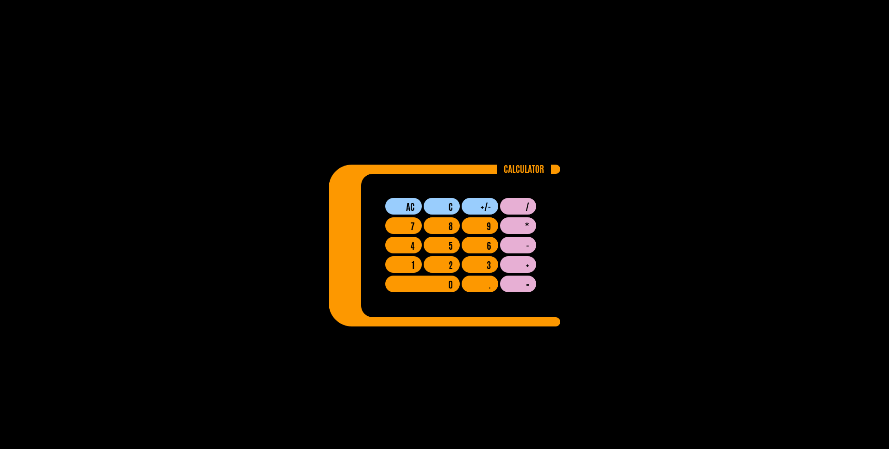

# The Odin Project - Calculator Project

This is a solution to the [Calculator Project of the Foundations Course on The Odin Project](https://www.theodinproject.com/lessons/foundations-calculator).

## Table of contents

- [Overview](#overview)
  - [The challenge](#the-challenge)
  - [Screenshot](#screenshot)
  - [Links](#links)
- [My process](#my-process)
  - [Built with](#built-with)
  - [What I learned](#what-i-learned)
  - [Continued development](#continued-development)
- [Author](#author)

## Overview

### The challenge

This final project is going to combine everything I’ve learned so far. I'm going to make an on-screen calculator using JavaScript, HTML, and CSS.

### Screenshot

### Links

- Solution URL: [https://github.com/wmartyr/top-calculator](https://github.com/wmartyr/top-calculator)
- Live Site URL: [https://wmartyr.github.io/top-calculator/](https://wmartyr.github.io/top-calculator)

## My process

### Built with

- Semantic HTML5 markup
- CSS custom properties
- Flexbox
- CSS Grid

### What I learned

I learned that you cannot use an html id that starts with a number. When you reference it using CSS and JS, it will fail.

I also had the opportunity to practice refactoring to prevent code duplication.

### Continued development

I couldn't figure out how to apply button effects when the keyboard is used.

## Author

- Woodrow Martyr
